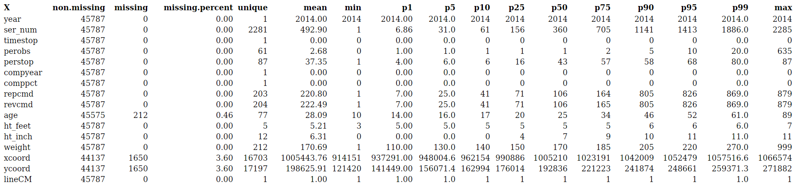
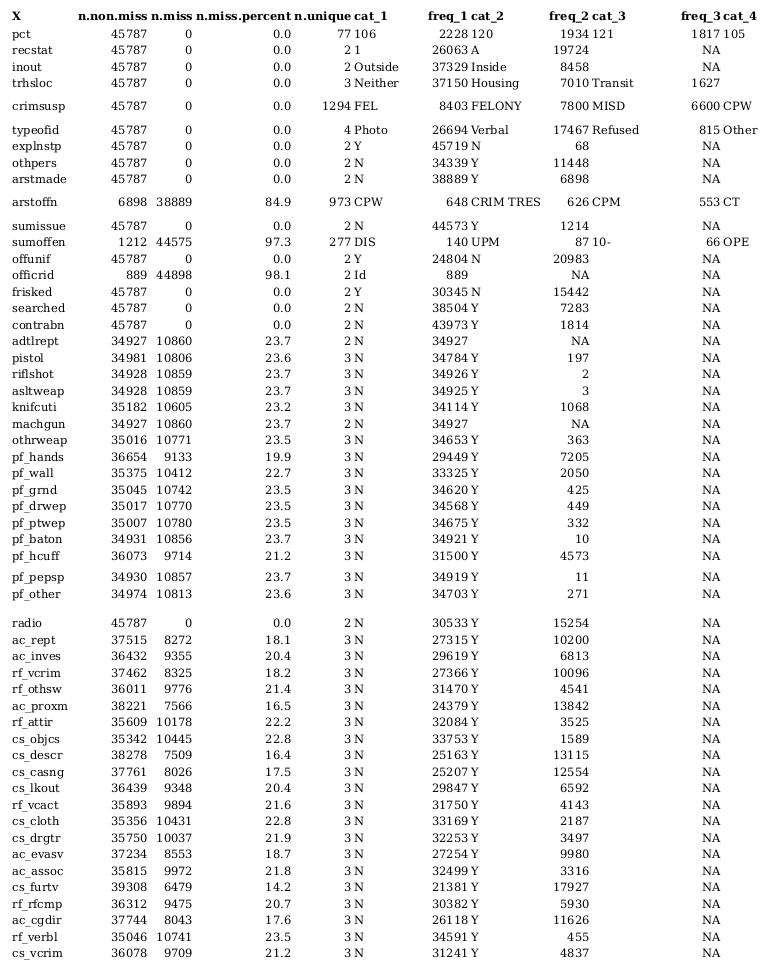
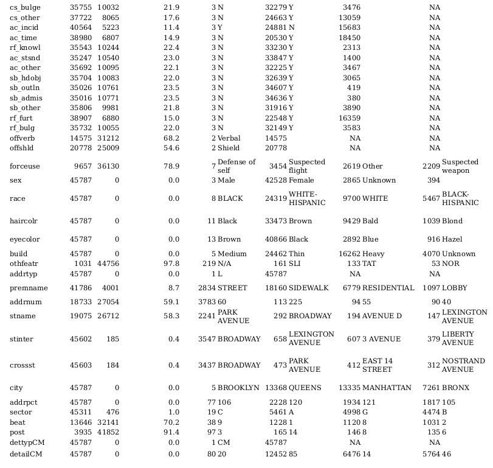

```{r}
if (! "dataQualityR" %in% installed.packages()) install.packages("dataQualityR", depend = TRUE)
library("dataQualityR")
if (! "knitr" %in% installed.packages()) install.packages("knitr", depend = TRUE)
library("knitr")
```

# 1. DESCRIPCIÓN DEL PROBLEMA

El programa ***[Stop and frisk](https://en.wikipedia.org/wiki/Stop-and-frisk_in_New_York_City)*** de la ciudad de Nueva York consiste en la práctica de detenciones temporales, interrogatorios e incluso cacheos a ciudadanos en busca de armas o cualquier tipo de contrabando. Los motivos en los cuales la policía puede ampararse para llevar a cabo estas prácticas se encuentran dentro de la ley criminal estadounidense.

La mayoría de detenciones producidas se centran en la población afroamericana y latina de la ciudad de edades comprendidas entre los 15 y los 25 años, lo cual ha generado gran controversia en torno a dicha ley. También contribuye al rechazo generado por la ley determinados **[estudios](https://www.washingtonpost.com/politics/2016/live-updates/general-election/real-time-fact-checking-and-analysis-of-the-first-presidential-debate/fact-check-trump-on-crime-statistics-and-stop-and-frisk/?utm_term=.52808601905f)** que demuestran que no existe relación entre el número de detenidos y la tasa de criminalidad de la ciudad. 

El departamento de policía de NY facilita de forma periódica **[datos](https://www.nyclu.org/en/stop-and-frisk-data)** sobre las detenciones realizadas en la ciudad. 9 de cada 10 personas detenidas son inocentes y aunque el número de detenciones se ha visto reducido considerablemente, pasando en 2011 de 685,724 detenciones a 22,939 en 2015, las proporciones según la etnia de las personas detenidas se han mantenido constantes.

Se generan distintos modelos a lo largo del trabajo para poder determinar la necesidad o no de arrestar a las personas detenidas.

# 2. DESCRIPCIÓN DE LOS DATOS

# 2.1 Diccionario de datos

```{r, message=FALSE, warning=FALSE}
if(!file.exists("../data/data_dictionary.csv"))
    download.file(paste("https://raw.githubusercontent.com/jorgenav/Stop-Frisk/",
                  "master/data/data_dictionary.csv", sep = ""),
                  "../data/data_dictionary.csv")

SQFdataDictionary <- read.csv("../data/data_dictionary.csv")

kable(SQFdataDictionary, caption="NYPD Stop Question Frisk Database 2014")
```


# 2.2 Data Quality Report

```{r, message=FALSE, warning=FALSE}
source("Cleaning_Data.R")

drq.num <- paste("./dqr_num.csv", sep = "")
drq.cat <- paste("./dqr_cat.csv", sep = "")
checkDataQuality(SQFdata, out.file.num = drq.num,  out.file.cat = drq.cat)
DQR.num <- read.csv("dqr_num.csv")
DQR.cat <- read.csv("dqr_cat.csv")
```

## 2.2.a Variables numéricas

Data Quality Report (Variables numéricas)



```{r, message=FALSE, warning=FALSE, echo = FALSE, eval = FALSE}
kable(DQR.num, caption="Data Quality Report (Variables numéricas)", format = "markdown")
```

## 2.2.b Variables categóricas

```{r, message=FALSE, warning=FALSE, echo = FALSE, eval = FALSE}
kable(DQR.cat, caption="Data Quality Report (Variables categóricas)", format = "markdown")
```

Data Quality Report (Variables categóricas)




# 3. PREPARACIÓN DE LOS DATOS

# 3.1 Depuración de los datos

